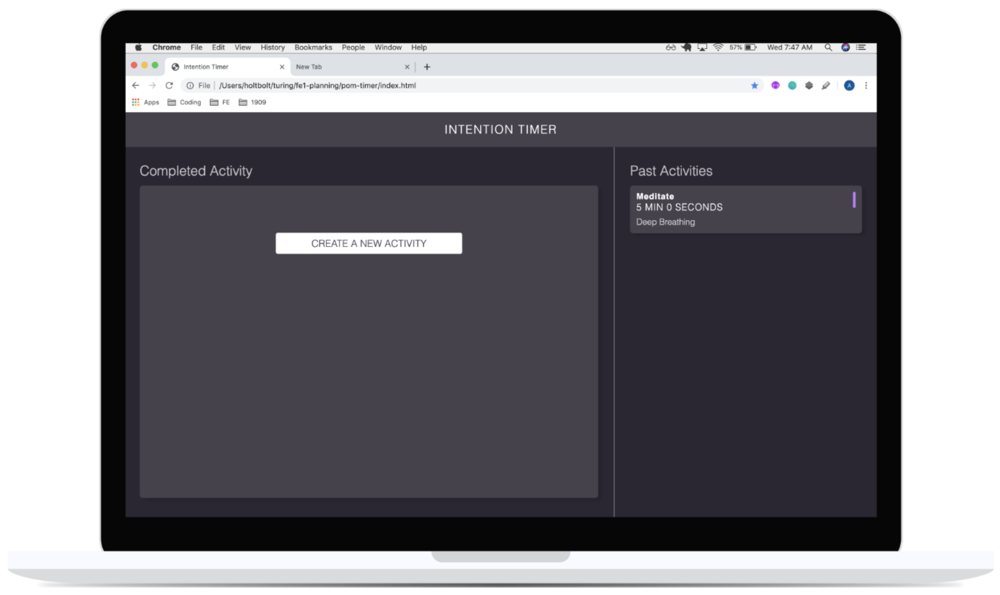
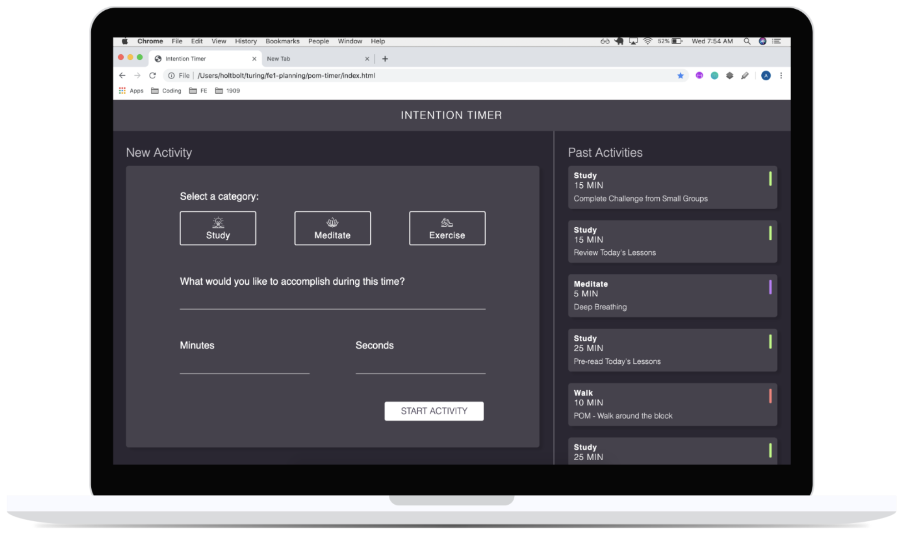

## Learning Goals

* Develop your skills in writing:
  * semantic HTML
  * clean & organized CSS styles
  * DRY and organized JavaScript
* Manipulate the page after it has loaded adding, removing, and updating elements on the DOM
* Understand event bubbling and use event delegation on dynamic elements

## Overview

You'll be building an application that allows a user to set goals for their health and productivity, tied to an amount of time. After setting a timer for a certain goal, the user can log that activity to keep track of how they spend with time.

## Set Up

Create a new directory called `intention-timer`. It should contain:
- `index.html`
- `styles.css`
- `main.js`
- `assets` (this is a directory that will hold your icon files)

Make sure both teammates and instructors are added as collaborators on the GitHub repository.

## Progression

### Iteration 0 - Zero State and Form Functionality

- Build the layout with HTML & CSS
  - Before moving on, the header and left side of the page should match the comp.
  - The right side of the page should only have the sub-header and not that no activities exist since you do not have past activity card functionality yet!

- Form Functionality
  - When an activity category is clicked on (`Exercise`, `Meditate`, or `Study`), the associated border and icon should change colors to give a visual indication that it has been selected. Colors are provided in comp.
  - An input field should be provided for `What would you like to accomplish during this time?`, `minutes` and `seconds`. The `minutes` and `seconds` fields should only accept numbers. (Hint: more than one layer should probably be put into place to ensure this. Make sure that `e` cannot be accepted.)
  - A `Start Activity` button is provided to submit the data entered into the form. When the button is clicked, the user should no longer see the form, and instead see a timer clock. The timer clock should display the minutes a seconds, as well the and description. The category should not appear, but the outline of the circle should match the color associated with the category.
  - If the `Start Activity` button is clicked before the user has entered information into all four inputs, the user will receive an error message, but will not lose any information that was provided.

### Iteration 1 - Build an MVP

- The user can start the time by clicking `Start`.
- While timer is running, the user should see it count down by second.
- When the timer completes, an [`alert`](https://developer.mozilla.org/en-US/docs/Web/API/Window/alert) should appear in the browser, letting the user know that the time is up. (This alert is temporary and is not something we suggest using in a fully built out application.)

### Iteration 2 - Logging Past Activities

- When the timer completes, the `alert` no longer appears.
- Instead, a motivational or congratulatory message appears on the left side of the page, replacing the timer.
- When the user acknowledges the message and completion of the activity by clicking `Log Activity`, a card with the `category`, `time`, and the users input for `What would you like to accomplish during this time?` should appear on the card. The card should also have a small color-coded visual indicator of the category. Color, size, and spacing of that visual indicator are provided in comp.
- Before moving on, your past activity cards should match the comp.

## Iteration 3 - Adding Functionality

For this iteration, your team can select one or both of the options below:

- **Option 1:** Expand/Collapse Reflection
  - When timer completes but before a card is created, the user can submit a reflection on the way they spent that time. Then, they can click the `Log Activity` button to create the card.
  - Even though there is more information about the activity, the reflection should not appear on the card immediately. The cards should still match the comp. The user should have a visual indicator that there is "more info" on a card. When the user takes the appropriate action, the card expands to show the reflection the user had submitted.
  - The user should also have a way to collapse the additional information/reflection.

- **Option 2:** Favorite & Re-Do
  - A user should be able to `favorite` or `re-do` an activity.
  - A favorite icon should be on the card. When clicked, the icon should change its appearance to communicate it has been favorited.
  - An icon to represent `re-do` should also be on the card. It should only be enabled when the left side of the page is displaying the `New Activity` form. If the `re-do` button is clicked, the form will populate with the data from the card that was clicked on.

**Consider the user experience:** the actions a user needs to take should be intuitive for someone who has never seen this application before. [Smashing Magazine](https://www.smashingmagazine.com/) contains great resources and articles, but their homepage also has some great examples of classy animations and hover states that convey something to the user.

Before moving on to an extension, the site should match the comp and any additions should be in the spirit of the comp and have been user-tested from a great user experience (UX).

## Iteration 4 - Extensions

- Once the user starts the timer, they have an option to pause the timer.
- An `Activity` class is written and utilized to hold the state of a given activity.

## Comp Details

### Colors

- Main background: `#2B2733`
- Text on main background: `#CBC9CF`
- Header, cards: `#46424D`
- Card shadow: `#26222D`
- Text on header and cards: `#FFF`
- Study: `#B3FD78`
- Meditate: `#C278FD`
- Exercise: `#FD8078`
- Error: `#EFB7EC`

### Icons

Active (color-coded) and non-active (white) icons are all stored [here](https://drive.google.com/drive/folders/1EpDeH6IeDTOaK3fP9YR_XkaB4mwCWZxm?usp=sharing). You will need to download and save these in an `assets` directory in your project.

### Fonts

[Montserrat](https://fonts.google.com/?query=mont&selection.family=Montserrat:300,400), both 300 and 400 weights are used in the comp

### Mobile Layouts

## Rubric

### Rubric Categories

- semantic HTML, DRY CSS, event delegation in JS, functionality, comp recreation
