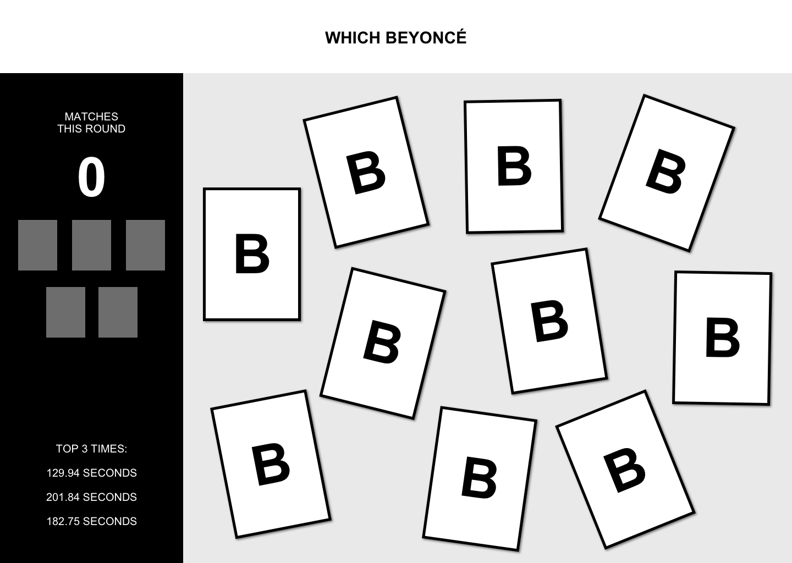
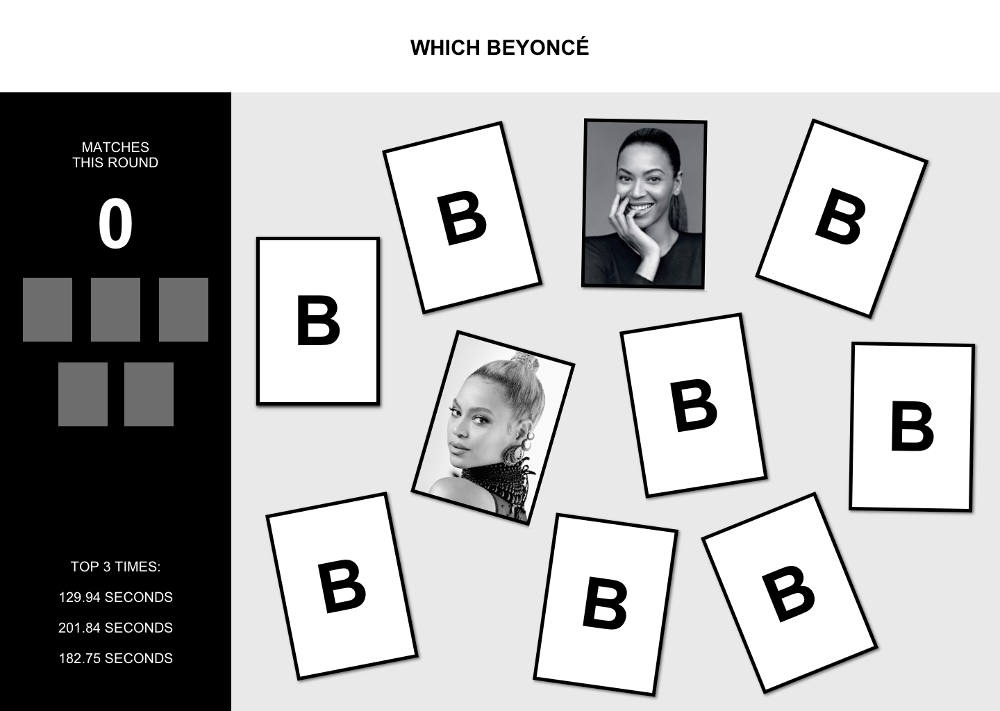
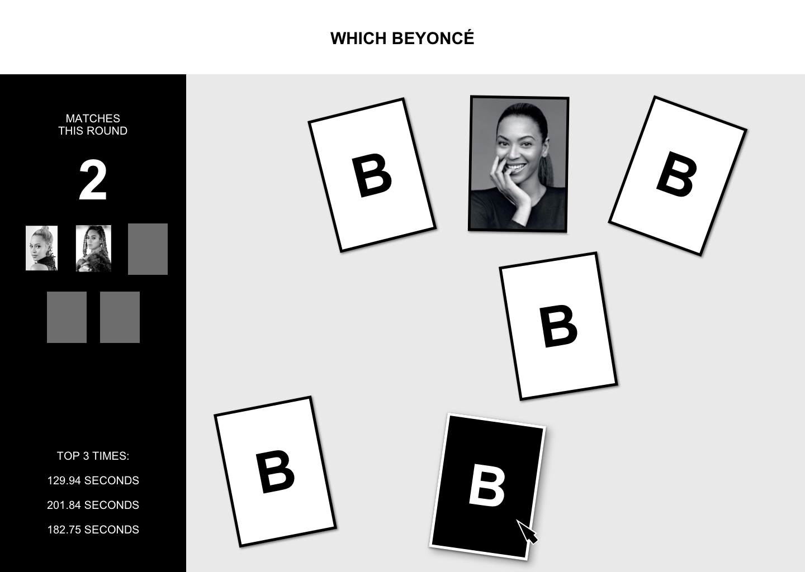
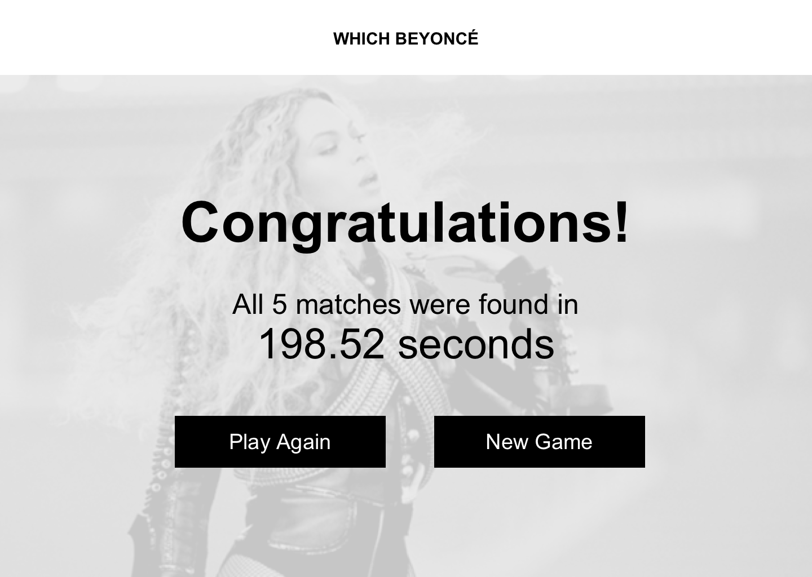

## Learning Goals

* Demonstrate separation of concerns:
  * Craft a data model using readable, DRY JavaScript
  * Display information on the DOM by iterating over data
* Use local storage to persist data
* Match/recreate a UI and create a great UX

## Overview

`Which Beyoncé?` is a game that replicates [Concentration](https://en.wikipedia.org/wiki/Concentration_(card_game)).

In early stages, it is a single player game. The user clicks two cards. If they're a match, the cards are removed. If not, the cards flip to facedown again, and the player continues guessing. Once all cards are matched, the game ends and displays a congratulatory message to the player, including how many seconds it took them to win.

## Set Up

Create a repository on GitHub and add both/all instructors as collaborators. Send over your repo link and GitHub pages as soon as it's up.

## Progression

### Iteration 0 - Initial Layout & UI

This should be completed by the end of the first day.

- Build out views for both the game page and win page (this should all be in a single HTML file)
- Build out the HTML for the cards to figure out how to scatter them (see the comp)
- BUT! Know that this hardcoded HTML will not be used; the cards will be programmatically created by the JavaScript in a later iteration
- Get at least a rough draft of your styling finished.

### Iteration 1 - Setting Up the Data Model

So what IS the data model?

In most complex applications, user inputs and moving pieces of information are handled by JavaScript, and stored in complex data types (arrays, objects). Once the data has been updated, _then_ the program uses those arrays and objects to display the new information on the DOM.

This is done for a few reasons:

- We never want to show information to the user that is not accurate
  - For example, if you Liked a tweet on Twitter, and you saw the red heart appear, you would expect that your Like had been saved, and if you refreshed the page, it would still show up
  - But what if Twitter built their logic to update the DOM first, and then try to save that info?
  - It would be possible to see a change, but for that change to not be stored anywhere.
  - We want to avoid that confusing situation!
- We are always going to store information in JS objects and arrays FIRST
- Then, we'll display that information on the DOM by iterating over our stored data

Sometimes you will hear this described as separating "business logic" from "display logic". It's also known as "separation of concerns" - that is, making sure that we're always updating our source of truth and then using it to display information on the DOM.

To do this, we're going to create two JavaScript classes: `Card` and `Deck`.

<section class="call-to-action">
### Data:

- Each card should get its data from an object instance of a Card class
- Each card should have a `matchInfo` property which will hold the same value as the card that matches it. You can determine how to format that matching value. Each card should also have a `matched` property, a boolean, that will default to false and toggle to true once a match has been made.
- Each card should have a method `match` on it
- All card object instances should be held in the *Deck* class
- The Deck should have `cards`, `matchedCards`, and `selectedCards` as properties. The Deck should have the following methods: `shuffle`, `checkSelectedCards`, and `moveToMatched`. If you find a need for additional methods, write/use them!
</section>

- Create two files: `card.js` and `deck.js`
- Build out both classes
- Consider:
  - What properties in the class should be dynamic, and which ones should be default?
  - What will each method do?
  - If you're not sure, look forward to future iterations to see when you might need it - it's okay to wait to define the method until you know how you need to use it!

### Iteration 2 - Rendering the Data Model

- Iterate over the `Deck`'s array of `Card` object instances to display the cards on the DOM (for now, don't worry about scrambling up the cards)
- User should see ten cards scattered across the screen, face down
- Leave the left-hand sidebar static for now; we will add that functionality in the next iteration
- **Data model:** When a user clicks a card, a copy of that card object instance should be added to the deck's `selectedCards` array
- **DOM:** When a user clicks a card, it should flip over, revealing the image (don't worry about finding matches until next iteration)
- **Data model:** When that card is clicked a second time, the copy of that card object instance should be removed from the deck's `selectedCards` array
- **DOM:** When that card is clicked a second time, it should flip to be face down again, showing the back of the card (the "B")
- Every card should be clickable in this way

### Iteration 3 - Making the game playable

- Once again, we'll leave the sidebar static (we'll begin updating it in the next iteration)
- User should **only** be able to flip over two cards at a time.
- **Data model:** If the two flipped cards match, the data model should be updated by using the appropriate `Deck` methods
- **DOM:** If the two flipped cards match, they should disappear from the DOM and the "Matches This Round" count should increase.
- If the cards don't match, the user should be able to re-click them to turn them back over.
- User should be able to continue playing until all matches have been found
- Once all matches are found, the user should see the page with a message congratulating them and telling them how long it took to find all the matches
- (The comp shows seconds, but we think minutes and seconds are more friendly to the user!)

### Iteration 4 - Refining gameplay

Now that you're getting the hang of using the data model to render things to the DOM, from now on, we're only going to give you the DOM functionality, and **it's up to you** to figure out how to update and use the data model to accomplish it!

- On the left hand side of the page, the player should see the number of "Matches This Round" updating as matches are found
- If this is not the first round, on the left hand side of the page, the player should see up to three of their best (shortest/fastest) times
- Every time a match is found and the cards are removed from the DOM, the photo of the match should appear in the left hand sidebar, replacing one of the gray boxes, to visually show the user which matches have been found
- Each time a user plays, the ten cards should be arranged **differently** - hint: the `Deck` class should handle this logic
- Instead of having to manually re-click a card to turn it back face-down, the program should automatically flip both cards over, after the user has had ___ seconds from the time both cards are revealed to view them. **This is a great opportunity to do some user testing and see what the right amount of time is!**
- Anytime a card flips over, there should be a smooth transition.

### Iteration 5 - Local Storage

- The users times should persist in Local Storage
- This will allow the user's best/shortest/fastest times to be displayed, even if they refresh the browser.

### Iteration 6 - Two Players

Now, we are going to update our game to allow two players to compete against one another. A complete round will consist of two games:
- Player 1 will play a complete game and find all the matches.
- **Instead of showing the win page**, a new game will automatically begin for Player 2
- When Player 2 finishes their game, the win page will show the winner based on whose time was fastest

<section class="call-to-action">
### Data:

- Each player should get its data from an object instance of a Player class
- Each player should have a `name` property and a `wins` property that defaults to an empty array
- Each player should have a `saveWin` method, which stores their game time in the `wins` array
- If you see the need for other properties or methods, you can absolutely add those!
</section>

Here is the desired functionality:
- Two users should be able to compete
- The players should first see a screen where they enter their names
- The players should be able to click the Begin Game button and be taken to the game screen
- The left hand sidebar should now also display the current player's name
- The left hand sidebar should display the top 3 fastest times and the name of the player who earned it (if no game data exists, in that space, display an encouraging phrase instead)
- **Note:** Consider how you will need to update your local storage functionality to be able to display the above data
- When a round is over (both players have played one complete game), the winning player and their time appears on the page.
- When the game is over, the users can click "Play Again" to start a new game without having to sign in and enter their names again - it should go directly to the game UI
- When the game is over, a new button should appear on the winning page that reads "New Game", which returns to the player sign in screen, so two new people can add their names and play
- If a user with the same name as someone of the "Top 5 Winners" board is playing, a trophy-like icon should appear on their side of the scoreboard to indicate that one (or both) of the players is a previous winner.

### Extensions

Remember: extensions are not required, and should only be attempted when all previous functionality has been completed, refactored to be DRY/readable/observe SRP, and polished to provide a smooth and intuitive user experience.

- The users should have the ability to pause the game. Once it is paused, time stops, and no cards can be clicked/flipped.
- Under each users name, the total number of wins they have had should appear. This should persist on page refresh. (Think about how this impacts your data for Player!)
- If the user leaves the page and comes back, the game will still be paused, but can resume from there (all cards in same position, same number of "matches" etc.)
- Test your classes (we can provide some assistance with the setup if you'd like to tackle this!)

## Comp

The font used in the comp is `Arial`.

Assets can be found here: [https://drive.google.com/drive/folders/14rYKBNTapq_Xs8KQKZXpYqqWzTg_PlRs?usp=sharing](https://drive.google.com/drive/folders/14rYKBNTapq_Xs8KQKZXpYqqWzTg_PlRs?usp=sharing)

You may use your own images if you're not feeling the Queen (😱), but don't spend more than 30 minutes gathering them.

### Single Player UI

When the user first comes to the site to play, they see the game:

Cards should flip when clicked:

Cards should be removed from the DOM and sidebar should update when matches are found:

When a user wins, they are taken to the winner screen:

### Two Player UI

When the users first come to the site to play, they should see a screen that takes both players names:

Once the users enter names and clicked "Play Game", they will be taken to the game board:

After a user wins, they will be taken to the winner screen:

**Note:** Only 1 HTML file should be used.

## Rubric

As you reference the rubric throughout the project the self-assess, keep in mind that the "bar" for each category is a 3. Sometimes, criteria for a 2 will not be listed under the criteria for a 3. To earn a 3, one must meet criteria for the 1 and 2. If there are any clarifying questions, make sure to speak with an instructor **before** the day of the evaluation.

Rubric score key:

* **4: Over-achievement** - student did self-teaching and accomplished beyond scope of project, _without_ sacrificing code quality in the pursuit of extensions; all code demonstrates strong mastery of DRY principles and SRP conventions
* **3: Right on track** - student is exactly where we want them to be, has a strong foundation, and demonstrates competency and comfort with the subject
* **2: A little behind** - student needs to focus study in this area to catch up to where they should be in terms of proficiency
* **1: Very behind** - student needs intervention to get back on track

## Functionality

* **4:** Iterations **0-6 are fully functional** with no bugs, and at least one extension has been fully implemented without bugs.
* **3:** Iterations **0-6 are fully functional**. One small bug may exist. (Point of clarity - a small bug is not a missing feature or a completely broken feature; it's a feature that usually works but behaves unexpectedly in certain edge cases.)
* **2:** Iterations **0-5 are fully functional** with no bugs.
* **1:** Iterations 0-4 are functional.

## Comp Recreation (UI and UX)

The topic does not have to be Beyonce. Besides assets and name of app, however, students are expected to recreate the comp.

* **4:** Additional elements that have been added **match** the visuals established in the comps. **Finished touches** such as `cursor: pointer` and additional visual cues on hover are thoughtfully implemented.
* **3:** Application implements all major comp details accurately and correctly on desktop and large TV. **Additional elements added generally match** the visuals established in the comps, but may be slightly awkward. **Nothing about the UI is confusing** to a user who has never seen this application before.
* **2:** Application implements all major comp details accurately and correctly on desktop. Some UI may be slightly confusing or unclear.
* **1:** Application implements most major comp details accurately and correctly on desktop.

## HTML

* **4:** Application uses BEM, SMACCS or another set of **naming conventions** for classes; all developers can explain those naming conventions. The form uses **WAI-ARIA** and is fully accessible.
* **3:** Application uses markup that is **easy to read** and follows across **naming conventions**.
* **2:** Application uses markup that incorporates **semantic HTML** elements and has a simple, clean HTML structure.
* **1:** Application uses markup that meets the criteria of the [Turing HTML Style Guide](https://github.com/turingschool-examples/html).

## JavaScript

* **4:**

  - **Code is well refactored** and demonstrates developer empathy.
  - No global variables are used aside from query selectors, start time, and instances of `Player` and `Deck`. If you feel you need more because you are building out additional functionality that requires a global variable, please check in with an instructor.
  - All functions are **less than 10 lines long** or otherwise demonstrate SRP.

* **3:**

  - The separation of data model logic and presentational logic is clear and can be explained by all developers in the team.
  - The application correctly **implements a data model** for the `Card` and `Deck` classes, including all required methods.
  - Developers can speak to the **role of each class**.
  - All DOM manipulation is handled exclusively in `main.js`.
  - Developers demonstrate understanding and ability to refactor code by having at least 1 example of DRY code that was intentionally reused.
  - SRP is evidenced by clear, concise function names; each function only does what the name describes.

* **2:**

  - Arguments and parameters are used to limit global variables.
  - The **event object** is used correctly, and is not accepted as a parameter if it is not necessary.
  - Developers can speak to **how the event object is utilized** for any given event handler.
  - **Function and variable names** describe their role in the program. Examples: The name of the data type should not ever be in a variable name (ex: "petArray"); the name itself should be clear enough to indicate the type of data it holds (ex: "allPets").
  - An event handler should not have "handler" in the name (ex: "clickHandler"); the name should indicate the handler's purpose (ex: "addNewPet").

* **1:**

  - Style and syntax meets the criteria of the [Turing JS Style Guide](https://github.com/turingschool-examples/javascript/tree/master/es5).
  - **Function declarations** are used over anonymous functions in event listeners.
